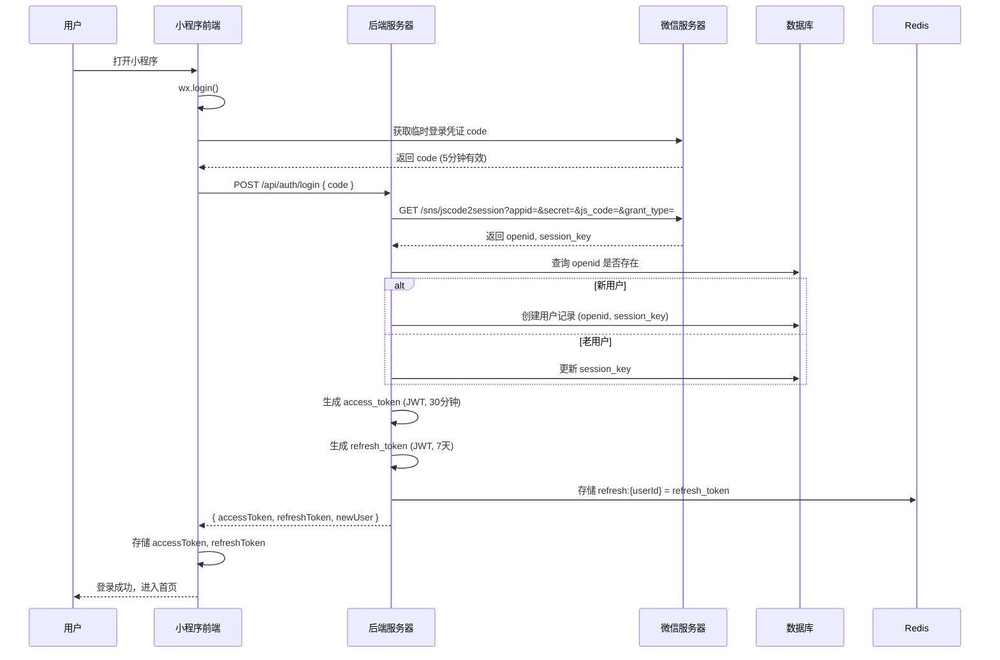
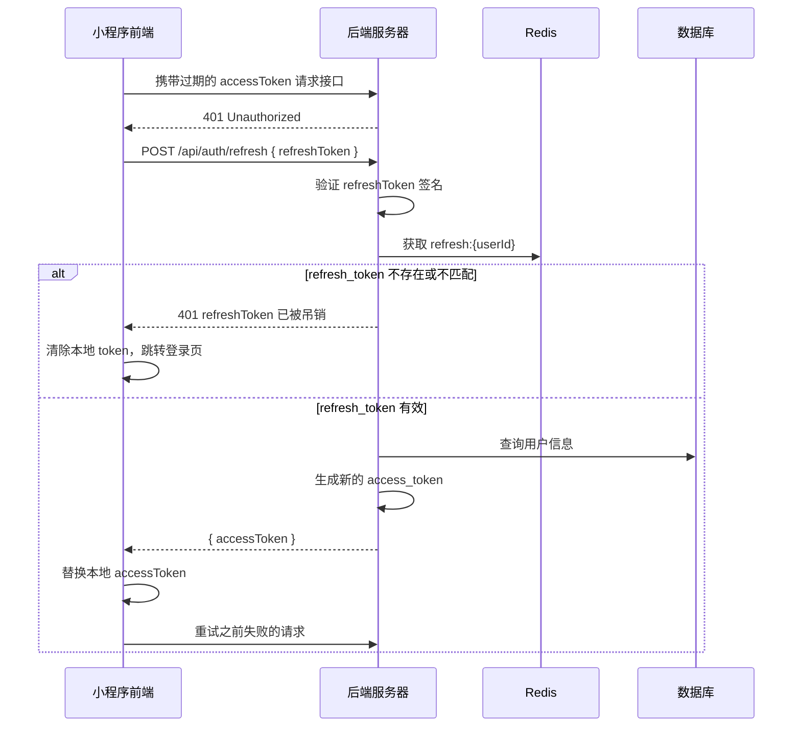
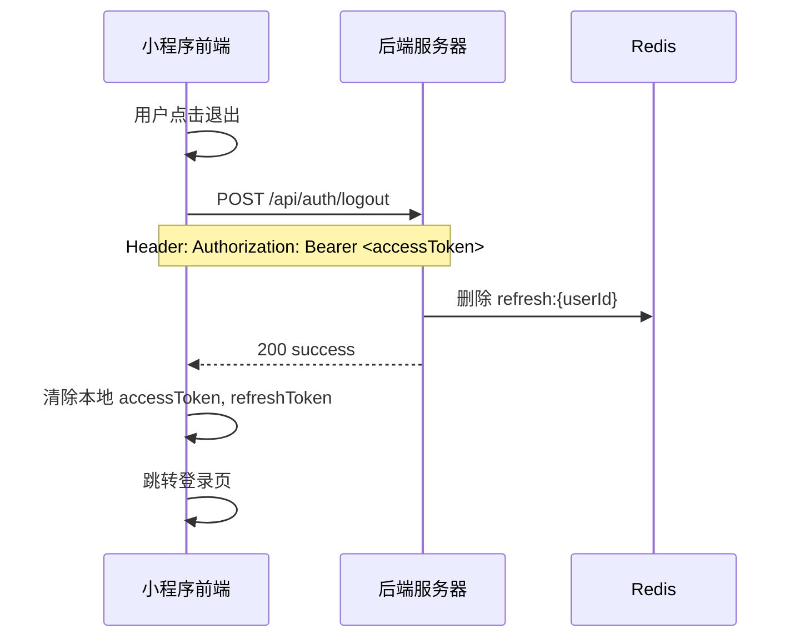
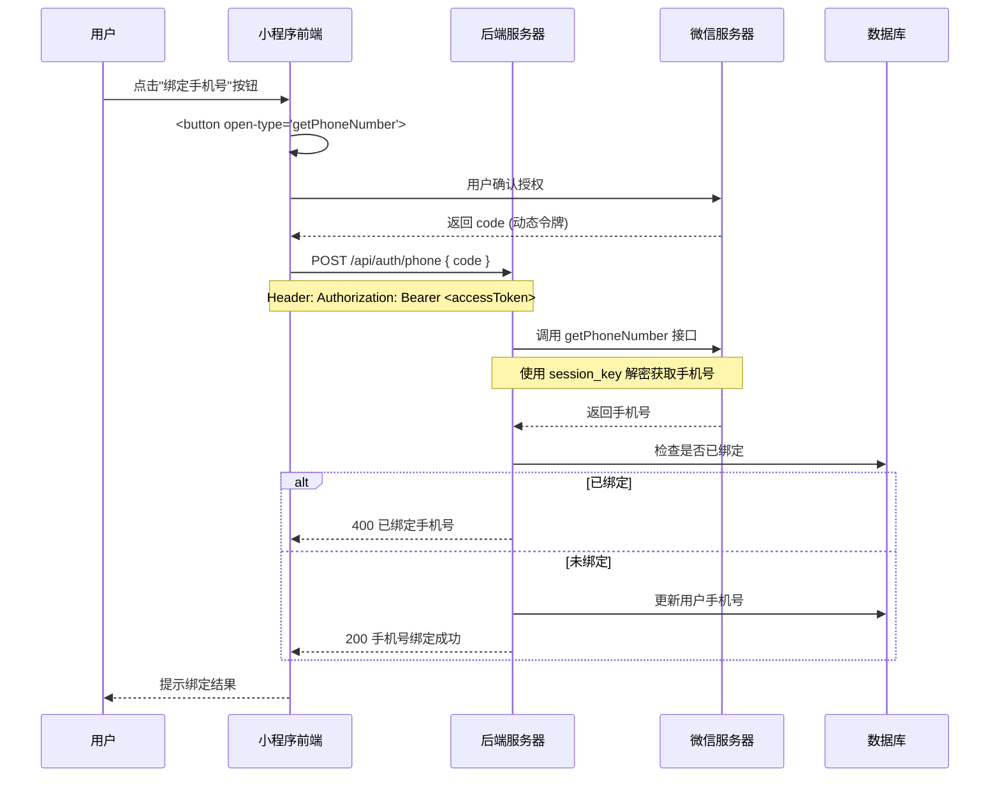
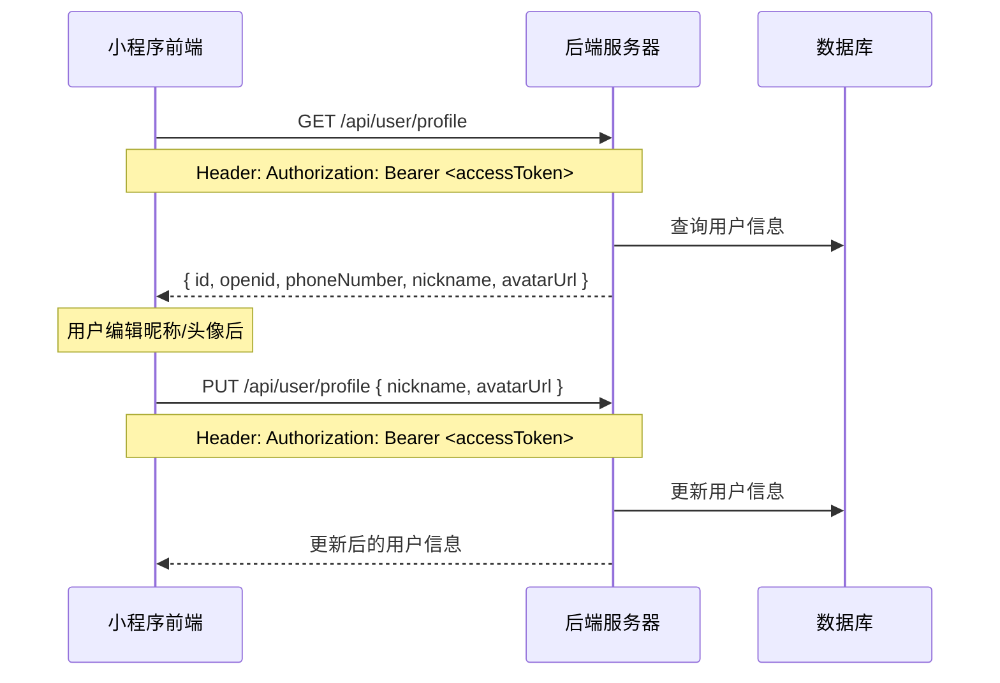
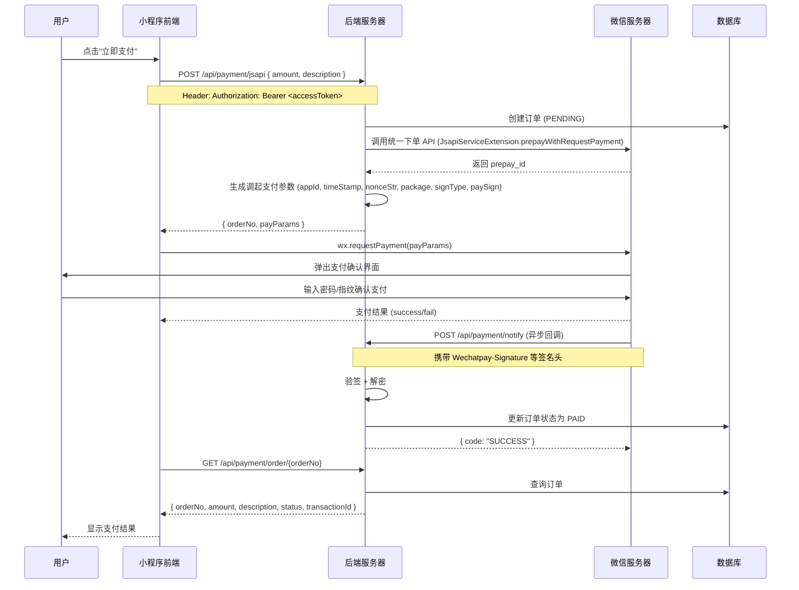
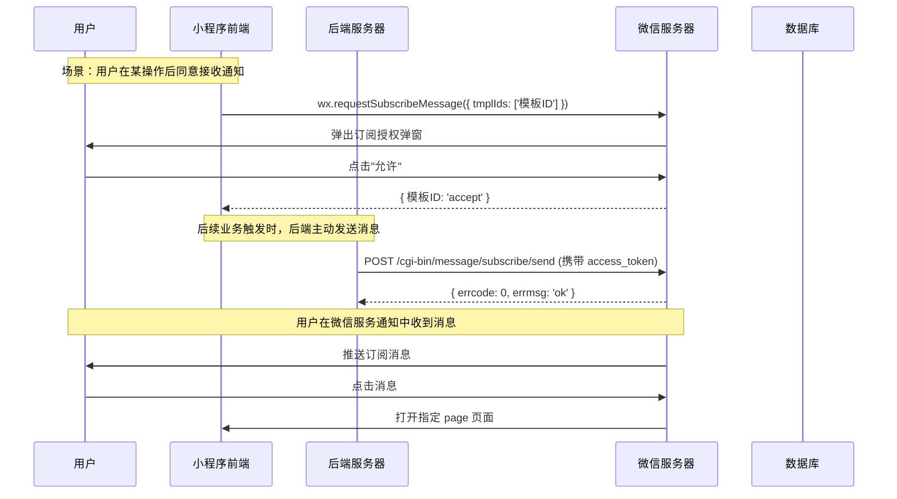
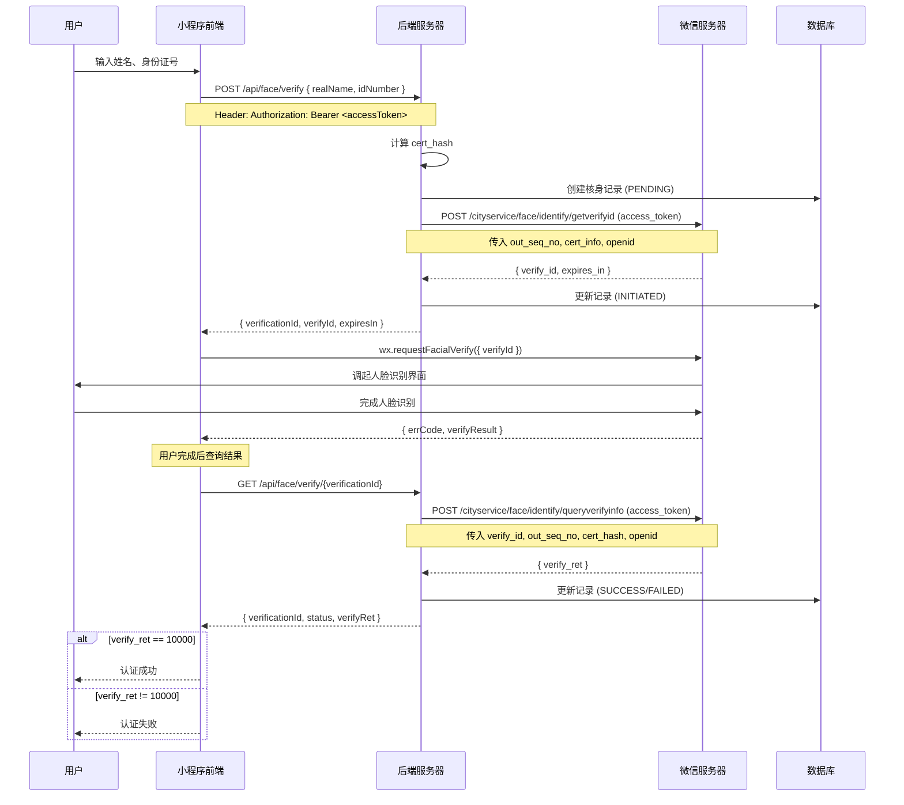

# 微信小程序前后端交互业务流程文档

> 本文档描述小程序前端与后端 API 的完整交互流程，包含 Mermaid 时序图，帮助前端开发人员理解每个业务场景中需要调用的微信 API 和后端接口。

---

## 目录

- [1. 用户登录](#1-用户登录)
- [2. Token 自动刷新](#2-token-自动刷新)
- [3. 用户登出](#3-用户登出)
- [4. 绑定手机号](#4-绑定手机号)
- [5. 获取/更新用户信息](#5-获取更新用户信息)
- [6. JSAPI 支付](#6-jsapi-支付)
- [7. 发送订阅消息](#7-发送订阅消息)
- [8. 人脸实名认证](#8-人脸实名认证)
- [附录：通用约定](#附录通用约定)

---

## 1. 用户登录

### 流程说明

1. 小程序调用 `wx.login()` 获取临时登录凭证 `code`
2. 前端将 `code` 发送到后端 `/api/auth/login`
3. 后端调用微信 `code2Session` 接口换取 `openid` 和 `session_key`
4. 后端生成 access token 和 refresh token，返回给前端
5. 前端存储 token，后续请求携带 access token

### 时序图



### 前端关键点

| 步骤 | 说明 |
|------|------|
| `wx.login()` | 获取 code，有效期 5 分钟，每次登录需重新调用 |
| 请求头 | 登录接口不需要 Authorization |
| Token 存储 | 建议使用 `wx.setStorageSync()` 存储 |
| 后续请求 | 所有需要认证的接口，请求头携带 `Authorization: Bearer <accessToken>` |
| `newUser` 字段 | 为 `true` 时表示首次登录，前端可跳转引导页 |

### 请求/响应示例

**请求:**
```http
POST /api/auth/login
Content-Type: application/json

{
  "code": "081xxxxxxxxxxxxxxx"
}
```

**响应:**
```json
{
  "code": 200,
  "message": "success",
  "data": {
    "accessToken": "eyJhbGciOiJIUzI1NiIs...",
    "refreshToken": "eyJhbGciOiJIUzI1NiIs...",
    "newUser": true
  }
}
```

---

## 2. Token 自动刷新

### 流程说明

当 access token 过期（30分钟）时，前端使用 refresh token 调用后端刷新接口获取新的 access token。

### 时序图



### 前端关键点

| 场景 | 处理方式 |
|------|----------|
| 接口返回 401 | 调用刷新接口 |
| 刷新成功 | 替换 accessToken，重试原请求 |
| 刷新失败（401） | 清除所有 token，跳转登录页 |
| 建议 | 封装统一的 request 拦截器，自动处理 401 和刷新 |

### 请求/响应示例

**请求:**
```http
POST /api/auth/refresh
Content-Type: application/json

{
  "refreshToken": "eyJhbGciOiJIUzI1NiIs..."
}
```

**响应:**
```json
{
  "code": 200,
  "message": "success",
  "data": {
    "accessToken": "eyJhbGciOiJIUzI1NiIs..."
  }
}
```

---

## 3. 用户登出

### 时序图



### 前端关键点

- 调用登出接口后，无论成功与否都应清除本地存储的 token
- 登出后跳转登录页

---

## 4. 绑定手机号

### 流程说明

1. 前端使用 `<button open-type="getPhoneNumber">` 触发微信手机号授权
2. 用户授权后，微信返回 `code`
3. 前端将 `code` 发送到后端，后端调用微信接口获取真实手机号并绑定

### 时序图



### 前端关键点

| 步骤 | 说明 |
|------|------|
| 按钮 | `<button open-type="getPhoneNumber" bindgetphonenumber="onGetPhone">` |
| 授权回调 | `e.detail.code` 即为手机号授权 code |
| 前提条件 | 用户必须先完成登录（有 accessToken） |
| 注意 | 每个 code 只能使用一次 |

### 请求/响应示例

**请求:**
```http
POST /api/auth/phone
Authorization: Bearer <accessToken>
Content-Type: application/json

{
  "code": "e7c5xxxxxxxxxxxx"
}
```

**响应:**
```json
{
  "code": 200,
  "message": "手机号绑定成功",
  "data": null
}
```

---

## 5. 获取/更新用户信息

### 时序图



### 前端关键点

- `GET /api/user/profile` — 进入个人中心时调用
- `PUT /api/user/profile` — 用户修改昵称或头像后调用，只传需要更新的字段

---

## 6. JSAPI 支付

### 流程说明

1. 前端提交订单信息（金额、描述）到后端
2. 后端创建订单，调用微信统一下单 API，返回调起支付所需参数
3. 前端使用 `wx.requestPayment()` 调起微信支付
4. 用户完成支付后，微信异步通知后端回调接口
5. 后端更新订单状态，前端轮询或等待支付结果

### 时序图



### 前端关键点

| 步骤 | 说明 |
|------|------|
| 下单 | `amount` 单位为**分**，最小值 1 |
| 调起支付 | `wx.requestPayment()` 参数来自后端返回的 `payParams` |
| 字段映射 | `payParams.packageValue` → `wx.requestPayment` 的 `package` 字段 |
| 支付结果 | `wx.requestPayment` 的 success/fail 回调仅表示用户操作结果，**不代表支付成功** |
| 确认支付 | 必须调用 `GET /api/payment/order/{orderNo}` 查询后端订单状态 |
| 轮询建议 | 支付完成后每 2 秒轮询一次，最多 10 次 |

### 请求/响应示例

**下单请求:**
```http
POST /api/payment/jsapi
Authorization: Bearer <accessToken>
Content-Type: application/json

{
  "amount": 100,
  "description": "商品购买"
}
```

**下单响应:**
```json
{
  "code": 200,
  "message": "success",
  "data": {
    "orderNo": "1712000000000a1b2c3d",
    "payParams": {
      "appId": "wx1234567890",
      "timeStamp": "1712000000",
      "nonceStr": "abc123",
      "packageValue": "prepay_id=wx20240101...",
      "signType": "RSA",
      "paySign": "xxxxx"
    }
  }
}
```

**调起支付代码:**
```javascript
wx.requestPayment({
  timeStamp: payParams.timeStamp,
  nonceStr: payParams.nonceStr,
  package: payParams.packageValue,
  signType: payParams.signType,
  paySign: payParams.paySign,
  success(res) {
    // 用户完成支付操作，需查询后端确认
    this.queryOrderStatus(orderNo)
  },
  fail(err) {
    // 用户取消支付或支付失败
    wx.showToast({ title: '支付取消', icon: 'none' })
  }
})
```

**查询订单响应:**
```json
{
  "code": 200,
  "message": "success",
  "data": {
    "orderNo": "1712000000000a1b2c3d",
    "amount": 100,
    "description": "商品购买",
    "status": "PAID",
    "transactionId": "4200001234567890"
  }
}
```

---

## 7. 发送订阅消息

### 流程说明

订阅消息需要用户在小程序中**主动授权**（点击按钮触发 `wx.requestSubscribeMessage`）。授权后，后端可随时向该用户发送对应模板的订阅消息。

### 时序图



### 前端关键点

| 步骤 | 说明 |
|------|------|
| 触发时机 | 必须由用户**主动操作**触发（如点击按钮），不能自动弹出 |
| API | `wx.requestSubscribeMessage({ tmplIds: ['模板ID1', '模板ID2'] })` |
| 授权结果 | 每个模板 ID 对应 `accept`（同意）/ `reject`（拒绝）/ `ban`（被封禁） |
| 注意 | 一次性订阅：每次授权只能发送**一条**消息。长期订阅需满足条件 |
| 后端触发 | 前端授权后，后端可在任意时间调用发送接口 |

### 后端发送接口

**向当前登录用户发送:**
```http
POST /api/message/subscribe
Authorization: Bearer <accessToken>
Content-Type: application/json

{
  "templateId": "模板ID",
  "page": "/pages/order/detail?id=123",
  "miniprogramState": "formal",
  "lang": "zh_CN",
  "data": {
    "thing1": "订单已发货",
    "time2": "2024-01-01 12:00:00"
  }
}
```

**通过 openid 发送（管理员接口）:**
```http
POST /api/message/subscribe/by-openid
Content-Type: application/json

{
  "openid": "oUpF8uMuAJO_M2pxb1Q9zNjWeS6o",
  "templateId": "模板ID",
  "page": "/pages/order/detail?id=123",
  "miniprogramState": "formal",
  "lang": "zh_CN",
  "data": {
    "thing1": "订单已发货",
    "time2": "2024-01-01 12:00:00"
  }
}
```

---

## 8. 人脸实名认证

### 流程说明

1. 前端收集用户输入的姓名和身份证号
2. 后端调用微信 `getverifyid` 接口获取 `verifyId`
3. 前端使用 `verifyId` 调起微信人脸识别
4. 用户完成人脸识别后，后端查询核身结果
5. `verify_ret=10000` 表示核身通过

### 时序图



### 前端关键点

| 步骤 | 说明 |
|------|------|
| 输入收集 | 前端需校验姓名和身份证号格式 |
| 发起核身 | 调用 `POST /api/face/verify` 获取 `verifyId` |
| 调起识别 | `wx.requestFacialVerify({ verifyId })` |
| 注意 | `verifyId` 有效期默认 3600 秒，过期后需重新发起 |
| 查询结果 | 识别完成后调用 `GET /api/face/verify/{verificationId}` |
| 成功条件 | `verify_ret === 10000` 且 `status === "SUCCESS"` |
| 重要 | 用于生成 `verifyId` 的 openid 必须与前端调用 `wx.requestFacialVerify` 的用户一致 |

### 请求/响应示例

**发起核身:**
```http
POST /api/face/verify
Authorization: Bearer <accessToken>
Content-Type: application/json

{
  "realName": "张三",
  "idNumber": "110101199001011234"
}
```

**响应:**
```json
{
  "code": 200,
  "message": "success",
  "data": {
    "verificationId": "a1b2c3d4e5f6...",
    "verifyId": "verify_id_xxxx",
    "expiresIn": 3600
  }
}
```

**调起人脸识别:**
```javascript
wx.requestFacialVerify({
  verifyId: verifyId,
  success(res) {
    // 识别完成，查询后端确认结果
    this.queryVerifyResult(verificationId)
  },
  fail(err) {
    wx.showToast({ title: '识别取消', icon: 'none' })
  }
})
```

**查询结果响应:**
```json
{
  "code": 200,
  "message": "success",
  "data": {
    "verificationId": "a1b2c3d4e5f6...",
    "status": "SUCCESS",
    "verifyRet": 10000,
    "errorMsg": null
  }
}
```

---

## 附录：通用约定

### Token 机制

| Token 类型 | 有效期 | 存储位置 | 用途 |
|-----------|--------|----------|------|
| access_token | 30 分钟 | 内存 / Storage | 所有需要认证的接口 |
| refresh_token | 7 天 | Storage | 刷新 access_token |

### 请求头规范

```
Authorization: Bearer <access_token>
Content-Type: application/json
```

### 统一响应格式

```json
{
  "code": 200,
  "message": "success",
  "data": { ... }
}
```

错误响应:
```json
{
  "code": 400,
  "message": "错误描述",
  "data": null
}
```

### 需要认证的接口

| 接口 | 认证 |
|------|------|
| `POST /api/auth/login` | 否 |
| `POST /api/auth/refresh` | 否 |
| `POST /api/auth/logout` | 是 |
| `POST /api/auth/phone` | 是 |
| `GET /api/user/profile` | 是 |
| `PUT /api/user/profile` | 是 |
| `POST /api/payment/jsapi` | 是 |
| `POST /api/payment/notify` | 否（微信回调） |
| `GET /api/payment/order/{orderNo}` | 是 |
| `POST /api/message/subscribe` | 是 |
| `POST /api/message/subscribe/by-openid` | 否（管理员接口） |
| `POST /api/face/verify` | 是 |
| `GET /api/face/verify/{verificationId}` | 否 |

### 前端 request 封装建议

```javascript
// 请求拦截
function request(url, options = {}) {
  const token = wx.getStorageSync('accessToken')
  const header = { 'Content-Type': 'application/json' }
  if (token) header['Authorization'] = `Bearer ${token}`

  return new Promise((resolve, reject) => {
    wx.request({
      url: `${BASE_URL}${url}`,
      method: options.method || 'GET',
      data: options.data,
      header,
      success(res) {
        if (res.statusCode === 401) {
          // access_token 过期，尝试刷新
          refreshToken().then(() => {
            // 重试原请求
            request(url, options).then(resolve, reject)
          }).catch(() => {
            // 刷新失败，跳转登录页
            wx.removeStorageSync('accessToken')
            wx.removeStorageSync('refreshToken')
            wx.redirectTo({ url: '/pages/login/login' })
          })
        } else if (res.data.code !== 200) {
          wx.showToast({ title: res.data.message, icon: 'none' })
          reject(res.data)
        } else {
          resolve(res.data)
        }
      },
      fail(reject)
    })
  })
}

// 刷新 token
async function refreshToken() {
  const refreshToken = wx.getStorageSync('refreshToken')
  const res = await request('/api/auth/refresh', {
    method: 'POST',
    data: { refreshToken }
  })
  wx.setStorageSync('accessToken', res.data.accessToken)
}
```

### 环境配置

| 配置项 | 说明 |
|--------|------|
| `BASE_URL` | 后端 API 基础地址，如 `https://api.example.com` |
| 小程序后台 | 需在微信公众平台配置 request 合法域名 |
